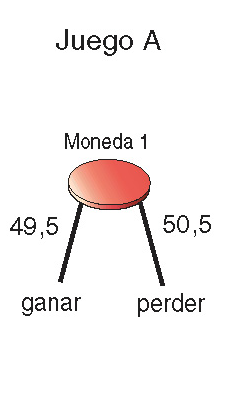
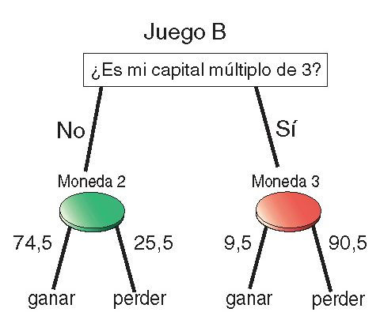

<style>
.list-group {
  font-size:medium
}
</style>

<style>
.list-group-item.active, .list-group-item.active:focus, .list-group-item.active:hover {
    background-color: #11bf42;
}
</style>

```{r setup, include=FALSE}
knitr::opts_chunk$set(echo = TRUE) 
```

## 1. De qué va este taller

A finales de los 90, un físico español llamado Juan Parrondo, profesor de la Universidad Complutense de Madrid, demostró que una combinación de dos estrategias perdedoras no siempre significa otra perdedora. En otras palabras, demostró que existen juegos desfavorables que, jugados alternativamente, se convierten en un juego ganador. 

Este descubrimiento paradójico fue definido por Andra Blakeslee en The New York Times^[Fuente: https://www.nytimes.com/2000/01/25/science/paradox-in-game-theory-losing-strategy-that-wins.html] como una *nueva ley de la naturaleza que puede ayudar a explicar, entre otras cosas, cómo surgió la vida a partir de una sopa primordial, por qué la popularidad del presidente Clinton aumentó después de ser atrapado en un escándalo sexual y por qué invertir en acciones que pierden a veces puede conducir a mayores ganancias de capital*.

En este taller vamos a ir descubriendo la paradoja poco a poco y la vamos a ver con nuestos propios ojos, haciendo simulaciones con R. Vamos a utilizar sentencias muy sencillas y útiles si te vas a introducir en el lenguaje. Si ya eres experto en él, quizás te interese conocer la paradoja porque es alucinante o puedes utilizarlo para enseñar R si te dedicas a ello.

## 2. El juego A

El profesor Parrondo ilustró su paradoja con dos juegos, llamémoslos Juego A y Juego B. El primero se juega con una moneda sesgada que sale cara con la probabilidad de 0.495 (por lo tanto, la probabilidad de cruz es 0.505). El jugador lanza la moneda y gana si sale cara. De lo contrario, pierde. ¿Jugarías este juego? Yo no lo haría. Dado que la probabilidad de perder es mayor que la de ganar, es cuestión de tiempo que pierda todo su dinero. 
<br>
[]()
<br>

Queremos ver qué sucede cuando un jugador juega el Juego A un número `n` de veces, comenzando con una cantidad inicial de dinero (capital). Comenzaremos definiendo una función llamada `juego_a`, que recibe un número entero `x` (el capital actual del jugador)  y devuelve la cantidad resultante después de lanzar la moneda definida previamente. Sumaremos `1` a `x` si la moneda sale cara (el jugador gana) y restaremos 1 en caso contrario (el jugador pierde):

```{r, message = FALSE, warning=FALSE}
 # Cargamos gglot2, la única librería que vamos a utilizar
library(ggplot2)

# Esta funcion actualiza la ganancia que tenga el jugador con la juego A
juego_a <- function(x) {
  x + sample(x = c(-1,1), size = 1, prob=c(0.505,0.495)) # moneda 1
}

```

El efecto del resultado de la moneda sobre el capital `x` está representado por la función `sample`, que suma 1 con probabilidad de 0.495 a `x` y resta 1 en caso contrario. Esta función crea una muestra del tamaño especificado a partir de los elementos de `x` con o sin reemplazo (opción predeterminada). Dado que estamos extrayendo solo un elemento de `x`, el reemplazo no importa. 

La forma de desequilibrar la muestra es utilizando el argumento `prob`. Hace coincidir cada elemento del conjunto `x` con un valor numérico que representa el peso que se le asigna para ser seleccionado. Además de poder definir tus propias funciones de distribución, como acabamos de hacer, hay varias funciones en R, para generar números bajo una distribución discreta conocida. Por ejemplo, para obtener 5 números siguiendo una distribución binomial con probabilidad de éxito igual a 0.2, puede hacer `rbinom (n = 5, size = 10, prob = 0.2)`.

Ahora, necesitamos dos variables para comenzar las simulaciones: el número de rondas a jugar (`rondas`) y un vector para almacenar la evolución de la cantidad a lo largo de todas las rondas (`ganancia`):

```{r, message = FALSE, warning=FALSE}
# Vamos a simular 2000 rondas
rondas <- 2000

# Inicializamos el vector de ganancias con 100 euros
ganancia <- numeric()
ganancia[1] <- 100
```

Ten en cuenta que `rondas` es un valor numérico y `ganancia` es un vector numérico, cuyo primer elemento es igual a 100 y representa la cantidad inicial del jugador que inicializamos en 100, que es una cantidad tan buena como cualquer otra.

El siguiente paso es simular un juego que consta de 2000 rondas (*tiradas*). En otras palabras, haremos que nuestro jugador imaginario lance la moneda 2000 veces y actualizaremos la cantidad después de cada lanzamiento:

```{r, echo=FALSE}
set.seed(1234)
```

```{r, message = FALSE, warning=FALSE}
# Simulamos una partida del total de rondas anterior
for (i in seq_len(rondas)) {
  ganancia[i+1] <- juego_a(ganancia[i])
}
```

El bucle `for` se utiliza para iterar sobre un vector. En nuestro caso, este vector es una secuencia regular de números naturales del 1 al 2000, que es el número de rondas. Esta secuencia también podría definirse como ` 1: rondas` o `seq (from = 1, to = rondas, by = 1)` produciendo la misma salida. La última forma usa la función `seq`, que es la manera genérica de crear secuencias regulares con R.

En cada iteración del ciclo `for`, se evalúa la declaración entre paréntesis y se toma el siguiente valor del vector. He usado un bucle `for` en este caso porque el número de iteraciones es pequeño y la eficiencia no es vital. De todos modos, ilustraré el uso de métodos más eficientes al final de este punto.

Una vez que ejecutamos este ciclo, el vector `ganancia` almacena la evolución del capital del jugador a lo largo de las 2000 rondas del juego (puedes inspeccionar sus primeros elementos con la función `head`).

Ahora podemos visualizar el resultado con la función `plot`:

```{r, message = FALSE, warning=FALSE}
# Representamos en un gráfico la evolución de la partida
plot(ganancia, 
     type="l", 
     xlab="Ronda",
     ylab="Ganancia",
     main="Partida del Juego A")
```

Desgraciadamente, nuestro jugador terminó la partida con menos dinero del que tenía al comienzo. Si ejecutas el código anterior, seguramente tu gráfico final no será igual que el mío. Esto es completamente normal ya que estamos usando diferentes semillas para obtener los números aleatorios, lo que provocará diferentes resultados al lanzar la moneda. También es posible que tu jugador, en comparación con el mío, termine con una cantidad superior a 100; después de todo, la probabilidad de ganar también es alta en sí misma.

¿Qué pasa si hacemos que nuestro jugador imaginario echara 200 partidas al juego, cada una de ellas de 2000 rondas? En primer lugar, encapsulemos los pasos anteriores en una función llamada `juego_a_n` que devuelve la evolución del capital después de una sola partida de n rondas. Nos ayudará a simular muchos juegos:

```{r, message=FALSE, error=FALSE}
juego_a_n <- function (n)
{
  x <- numeric() # x representa la ganancia
  x[1] <- 100    # la inicializamos en 100 euros
  for (i in seq_len(n))
    x[i+1] <- juego_a(x[i])
  return(x)
}
```

Ahora podemos hacer que nuesto jugador eche 200 partidas de 2000 tiradas cada una usando la función `replicate`:

```{r, message=FALSE, error=FALSE}
muchas_partidas_a <- replicate(200, juego_a_n(2000))
```

Ahora, el objeto muchas_partidas_a es una matriz de 2 dimensiones, con 2001 filas (cantidad de rondas más el capital inicial) y 200 columnas (cantidad de partidas). 

```{r, message=FALSE, error=FALSE}
dim(muchas_partidas_a)
```

Podemos visualizar la evolución de todas las partidas con la función `matplot`:

```{r, message=FALSE, error=FALSE}
matplot(muchas_partidas_a, 
        type="l", 
        xlab="ronda",
        ylab="ganancia",   
        main="Muchas partidas del juego A",
        col=rainbow(20))

```

Incluso siendo un gráfico un poco caótico, nos da una idea de cómo terminaron todas las partidas. Puedes ver cómo la mayoría de las simulaciones terminan por debajo de la cantidad inicial de 100: en promedio, el Juego A es un mal juego. Para verlo claramente, extraigamos el capital final de cada una de las 200 partidas:


```{r, message = FALSE, warning=FALSE}
ganancia_final_a <- muchas_partidas_a[2001,]
```

Podemos usar `geom_histogram` para visualizarlo con `ggplot`:

```{r, message = FALSE, warning=FALSE}
ggplot() + 
  aes(ganancia_final_a) + 
  geom_histogram(colour="black", fill="orange")+
  labs(title="Muchas partidas del juego A",
       subtitle="Ganancia final",
       x="Ganancia")
```

Ahora se ve más claro que la distribución del capital final está centrada por debajo de 100. Puedes ver unos cuantos estadísticos de dicha distribución haciendo un `summary`:

```{r, message = FALSE, warning=FALSE}
summary(ganancia_final_a)

```

Ahora lo que vamos a hacer es variar el número de rondas (que durante todo el experimento ha estado fijado en 2000) para comprobar que cuantas más rondas, más dinero pierde nuestro jugador. Como hemos hecho antes, lo primero que hacemos en crear una función que calcule el valor promedio del capital final tras m partidas de n *tiradas* cada una:

```{r, message = FALSE, warning=FALSE}
juego_a_n_m <- function (n, m){
  x <- replicate(m, juego_a_n(n))
  mean(x[n+1,])
}
```

Ahora creamos un vector con las rondas que vamos a simular. Para ello usamos la función `seq`. Vamos a probar 500, 750, 1000, ... y 3500 rondas:

```{r, message = FALSE, warning=FALSE}
rondas <- seq(from = 500, to = 3500, by = 250)
```

Estos son los valores que contiene nuestro vector `rondas`:

```{r, message = FALSE, warning=FALSE}
rondas
```

Ahora vamos a utilizar otra manera de iterar con R, que es la familia de funciones `apply`. Este es un método más eficiente que un bucle `for` y funciona para aplicar una función sobre los elementos de un objeto (vector, data frame, lista ...) de forma independiente. Nosotros vamos a aplicar nuestra función `juego_a_n_m` sobre cada elemento de rondas. Fíjate en que el segundo argumento de la función lo fijamos a 200, y los elementos de `juego_a_n_m` sirven para dar valor al primer argumento.

```{r, message = FALSE, warning=FALSE}
ganancia_promedio_final <- sapply(rondas, function(x) juego_a_n_m(x, 200))
```

Vamos a volver a utilizar la función `ggplot` para visualizar los valores de `ganancia_promedio_final`. Para ello, lo primero que vamos a hacer es crear un data frame (que llamaremos `datos`) con las dos coumnas que vamos a representar: `rondas` y `ganancia_promedio_final`. Esto nos facilitará la tarea de hacer el gráfico.

```{r, message = FALSE, warning=FALSE}
datos <- data.frame(rondas = rondas,
                    ganancia_promedio_final = ganancia_promedio_final)
```

Estos son las primeras filas de `datos`:

```{r, message = FALSE, warning=FALSE}
head(datos)
```

Ahora podemos hacer un scatter con ambas variables utilizando `geom_point` y `geom_line`:

```{r, message = FALSE, warning=FALSE}
ggplot(datos, aes(x = rondas, y = ganancia_promedio_final)) + 
    geom_point() +
    geom_line() +
  labs(title = "Ganancia final según número de rondas",
       subtitle = "Juego A. Promedio de 200 tiradas",
       x = "Número de rondas",
       y = "Ganancia final")
```

Está claro: cuantas más tiradas, peor. El juego A no es favorable en absoluto para el jugador.

## 3. El juego B

El juego B es más complicado ya que combina dos monedas sesgadas. Una de ellas (la moneda 2 del diagrama de abajo) es muy favorable para el jugador ya que la probabilidad de obtener cara (ganar) es del 74,5%. En cambio, la otra (la moneda 3 del diagrama) es extremadamente desfavorable ya que la probabilidad de salir cara es solo del 9,5%. Para elegir qué moneda lanzar, el jugador debe evaluar su capital actual. Si es múltiplo de 3, jugará con la moneda desfavorable y si no, jugará con la favorable: ¿jugarías este juego?.

<br>
[]()
<br>

A simple vista no es fácil adivinar si es un juego bueno o malo para el jugador así que vamos a simularlo. Para hacerlo, la gran diferencia con el primer juego es la función que actualiza el capital, que en este caso vamos a llamar `juego_b` y es la siguiente:

```{r, message = FALSE, warning=FALSE}
# Esta funcion actualiza la ganancia que tenga el jugador con el juego B
juego_b <- function(x) {
  ifelse(x %% 3 != 0, 
         x + sample(c(-1,1), 1, prob=c(0.255, 0.745)),
         x + sample(c(-1,1), 1, prob=c(0.905, 0.095)))
}
```

Te dejo a tí que simules y visualices un juego individual. Yo voy directamente a simular 200 partidas de 2000 tiradas empezando todas ellas con un capital inicial de 100 y usando la función `replicate`, tal y como hicimos también anteriormente:

```{r, message = FALSE, warning=FALSE}
# Para generar n tiradas del nuevo juego b
juego_b_n <- function (n)
{
  x <- numeric()  # x representa la ganancia
  x[1] <- 100     # la inicializamos en 100 euros
  for (i in seq_len(n))
    x[i+1] <- juego_b(x[i])
  x
}

# Generamos 200 partidas del juego B
muchas_partidas_b <- replicate(200, juego_b_n(2000))

# Las visualizamos
matplot(muchas_partidas_b, 
        type="l", 
        xlab="ronda",
        ylab="ganancia",   
        main="Muchas partidas del juego B",
        col=rainbow(20))
```

Al igual que ocurría con el juego A, se ve cómo la mayoría de las partidas acaban mal para el jugador. Para verlo mejor, nos quedamos con el capital final de todas ellas y lo representamos con un histograma tal y como hicimos también para el juego anterior:

```{r, message = FALSE, warning=FALSE}
# Nos quedamos con la ganancia final de las 200 partidas
ganancia_final_b <- muchas_partidas_b[2001,]

ggplot() + 
  aes(ganancia_final_b) + 
  geom_histogram(colour="black", fill="orange")+
  labs(title="Muchas partidas del juego B",
       subtitle="Ganancia final",
       x="Ganancia")
```

Por si no queda claro hacemos también un summary de `ganancia_final_b`:

```{r, message = FALSE, warning=FALSE}
summary(ganancia_final_b)
```

Para terminar, volvemos a ver la relación entre el número de tiradas y el promedio final de 200 partidas:

```{r, message = FALSE, warning=FALSE}
juego_b_n_m <- function (n, m){
  x <- replicate(m, juego_b_n(n))
  mean(x[n+1,])
}

rondas <- seq(from = 500, to = 3500, by = 250)

ganancia_promedio_final <- sapply(rondas, function(x) juego_b_n_m(x, 200))

datos <- data.frame(rondas = rondas,
                    ganancia_promedio_final = ganancia_promedio_final)

ggplot(datos, aes(x = rondas, y = ganancia_promedio_final)) + 
  geom_point() +
  geom_line() +
  labs(title = "Ganancia final según número de rondas",
       subtitle = "Juego B. Promedio de 200 tiradas",
       x = "Número de rondas",
       y = "Ganancia final")

```

Vuelve a quedar claro que el juego B es desfavorable para el jugador.

## 4. Aquí viene la magia: la combinación de juegos

Imagina ahora que el jugador decidiera aleatoriamente a qué juego jugar antes de cada tirada. Puedes pensar en que lanzara una nueva moneda perfectamente equilibrada y si sale cara juega al juego A y si sale cruz, al B. El sentido común (al menos el mío) indica que este nuevo juego, que llamaremos Juego AB, seguirá siendo desfavorable ara el jugador: ¿cómo no va a serlo si tanto A como B lo son? Pues no. Este nuevo juego es favorable y lo vamos a comprobar empíricamente.

Una vez mas necesitamos una función que actualice el capital, que en este caso vamos a llamar `juego_ab`:

```{r, message = FALSE, warning=FALSE}
# Esta funcion actualiza la ganancia que tenga el jugador con el juego AB
juego_ab <- function(x) {
  lanzo_moneda_justa <- sample(x = c("cara", "cruz"), 
                               size = 1, 
                               prob=c(0.5 ,0.5))
  ifelse(lanzo_moneda_justa == "cara", juego_a(x), juego_b(x))
}
```

Como puedes comprobar, esta función lo primero que hace es *lanzar* una moneda justa, y elegir un juego u otro dependiendo del resultado.

Vamos directamente a simular 200 partidas de 2000 tiradas con este nuevo juego:

```{r, message = FALSE, warning=FALSE}
# Para generar n tiradas del nuevo juego b
juego_ab_n <- function (n)
{
  x <- numeric()  # x representa la ganancia
  x[1] <- 100     # la inicializamos en 100 euros
  for (i in seq_len(n))
    x[i+1] <- juego_ab(x[i])
  x
}

# Generamos 200 partidas del juego AB
muchas_partidas_ab <- replicate(200, juego_ab_n(2000))

# Las visualizamos
matplot(muchas_partidas_ab, 
        type="l", 
        xlab="ronda",
        ylab="ganancia",   
        main="Muchas partidas del juego AB",
        col=rainbow(20))
```

¿Lo ves? Ahora la mayoría de ellas acaban con un capital superior a 100.Ya te has dado de bruces cn la paradoja: ¿no es alucinante? Para verlo mejor, nos quedamos con el capital final de todas ellas y lo representamos con un histograma tal y como hicimos también anteriormente:

```{r, message = FALSE, warning=FALSE}
# Nos quedamos con la ganancia final de las 200 partidas
ganancia_final_ab <- muchas_partidas_ab[2001,]

ggplot() + 
  aes(ganancia_final_ab) + 
  geom_histogram(colour="black", fill="orange")+
  labs(title="Muchas partidas del juego AB",
       subtitle="Ganancia final",
       x="Ganancia")
```

Hacemos también un `summary` de `ganancia_final_ab`:

```{r, message = FALSE, warning=FALSE}
summary(ganancia_final_ab)
```

Ahora cuantas más tiradas, mejor:

```{r, message = FALSE, warning=FALSE}
juego_ab_n_m <- function (n, m){
  x <- replicate(m, juego_ab_n(n))
  mean(x[n+1,])
}

rondas <- seq(from = 500, to = 3500, by = 250)

ganancia_promedio_final <- sapply(rondas, 
                                  function(x) juego_ab_n_m(x, 200))

datos <- data.frame(rondas = rondas,
                    ganancia_promedio_final = ganancia_promedio_final)

ggplot(datos, aes(x = rondas, y = ganancia_promedio_final)) + 
  geom_point() +
  geom_line() +
  labs(title = "Ganancia final según número de rondas",
       subtitle = "Juego AB. Promedio de 200 tiradas",
       x = "Número de rondas",
       y = "Ganancia final")

```

Una elección al azar ha convertido dos juegos desfavorables en otro favorable. Esto es completamente contraintuitivo, pero se explica matemáticamente. Si quieres profundizar en la paradoja de Parrondo y quieres profundizar en ella, [aquí](http://parrondoparadox.blogspot.com/2011/02/mathematical-background-of-parrondos.html) puedes encontrar su demostración matemática.


## 5. Recapitulación

Con este experimento hemos visto cosas importantes de R, destacando sobre todo las distintas maneras que hay de iterar: `for`, `replicate` y `apply`.

Hay una manera más concisa de hacer el bucle `for` del principio, utilizando la función `accumulate` del paquete `purrr`. Esta función aplica secuencialmente una función de 2 argumentos a los elementos de un vector. Cada aplicación de la función utiliza el resultado de la aplicación anterior como primer argumento (o el valor inicial en la iteración 1). El segundo argumento es el siguiente valor del vector. Los resultados de cada aplicación se devuelven en una lista o vector si es posible. El siguiente código es equivalente al resultado del bucle que hicimos al principio para simular la evolución de una partida de 2000 rondas:

```{r, eval = FALSE}
library(purrr)
ganancia <- accumulate(1:2000, ~.x + ifelse(runif(1) < 0.495, 1, -1), 
                     .init=100)

```


También hemos utilizado `ggplot2`, una de las librerías más importantes de R para visualización de datos.

Si te ha gustado este experimento, puedes probar con el [problema de Monty Hall](https://es.wikipedia.org/wiki/Problema_de_Monty_Hall), otro resultado contraintuitivo que te gustará comprobar con tus propios ojos.
